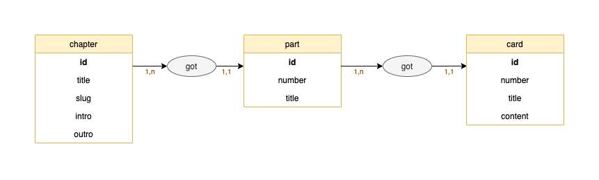

# La Folle Histoire du Progrès

This is the backend repository for "La Folle Histoire du Progrès" web documentary project.

[Front repo](https://github.com/shatice/machineavapeur)

[Website](https://lafollehistoireduprogres.netlify.app/)

[API](https://folle-histoire-progres.herokuapp.com/api)

[Back Office](https://folle-histoire-progres.herokuapp.com/admin)

*Ce site a été réalisé à des fins pédagogiques dans le cadre du cursus Bachelor de l’école HETIC. Les contenus présentés n'ont pas fait l'objet d'une demande de droit d'utilisation. Ce site ne sera en aucun cas exploité à des fins commerciales et ne sera pas publié*

## Architecture du projet

La partie Backend du projet est un **Back Office** permettant d'en gérer son contenu. Il est ainsi très facile de **créer modifier** et **supprimer** un chapitre, une sous-partie ou une carte.

Ci-dessous le **Modèle Conceptuel de Données** :

Une fois les entités renseignées dans Symfony, deux *bundles* nous ont permis de gérer efficacement l'administration et le service de la donnée.

### EasyAdmin

Le bundle EasyAdmin nous a permis de créer un back office propre et répondant à nos besoins de création de contenus textuels.
Cette interface est sécurisée par login.

### API Platform

Enfin la donnée est mise à disposition grace à API Platform. Quelques paramétrages restent essentiels pour garantir un API de qualité: 

  - Autoriser uniquement les requêtes en **GET**
  - **Groupes de sérialisation**, pour ne renvoyer que les champs désirés (ne pas renvoyer des champs d'ID par exemple)
